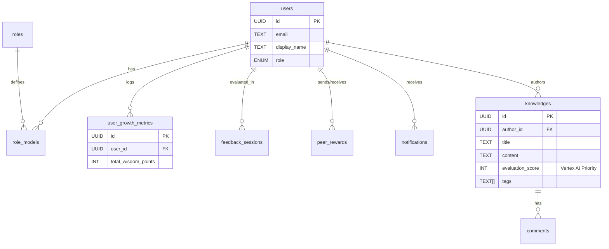

# 01_DATABASE_SCHEMA.md

## 概要

OWLightのデータベースは **PostgreSQL (Supabase)** 上に構築されます。
ユーザー情報、ロールモデル、成長ログ、ナレッジの実体データなどの**リレーショナルデータ**を管理します。

**重要なアーキテクチャ方針:**

* **ベクトルデータ/検索インデックス**: Supabase (PostgreSQL) では管理しません。**Google Cloud Vertex AI Agent Builder (Vertex AI Search)** 側で管理されます。
* **データ同期**: `knowledges` テーブルの更新時に、API経由でリアルタイムに Vertex AI へデータをプッシュします (`indexDocument`)。検索ランキングの重み付けに使用する `evaluation_score` もメタデータとして渡します。

## ER図 (Entity Relationship Diagram)

## テーブル定義詳細

### 1. Core & Knowledge (ナレッジ基盤)

#### `public.users`

ユーザーの基本プロフィール。Supabase Authと連動。

| Column | Type | Constraints | Description |
| --- | --- | --- | --- |
| `id` | UUID | PK, FK(auth.users) | ユーザーID |
| `email` | TEXT | UNIQUE, NOT NULL | メールアドレス |
| `display_name` | TEXT | NOT NULL | 表示名 |
| `avatar_url` | TEXT |  | アバター画像URL |
| `bio` | TEXT |  | 自己紹介 |
| `role` | TEXT | DEFAULT 'general' | 'admin', 'manager', 'general' |
| `created_at` | TIMESTAMPTZ | DEFAULT NOW() | 登録日時 |

#### `public.knowledges`

ナレッジ記事の実体データ。**ここにあるデータが Vertex AI に同期されます。**

| Column | Type | Constraints | Description |
| --- | --- | --- | --- |
| `id` | UUID | PK | ID |
| `author_id` | UUID | FK(users) | 作成者ID |
| `title` | TEXT | NOT NULL | タイトル |
| `content` | TEXT | NOT NULL | 本文 (Markdown) |
| `tags` | TEXT[] | DEFAULT '{}' | タグ配列 (Supabase側フィルタ用) |
| `evaluation_score` | INTEGER | DEFAULT 0 | **Vertex AI連携用スコア (優先度)** |
| `source_url` | TEXT |  | 原本ファイルのGCSパス (gs://...) |
| `is_public` | BOOLEAN | DEFAULT TRUE | 公開フラグ |
| `created_at` | TIMESTAMPTZ | DEFAULT NOW() | 作成日時 |
| `updated_at` | TIMESTAMPTZ | DEFAULT NOW() | 更新日時 (Vertex同期トリガー) |

### 2. Role Model Module (役割診断)

#### `public.roles`

フクロウのタイプ（役割）定義マスタ。

| Column | Type | Constraints | Description |
| --- | --- | --- | --- |
| `id` | UUID | PK | ロールID |
| `key` | TEXT | UNIQUE, NOT NULL | 'innovator' 等の参照キー |
| `name` | TEXT | NOT NULL | ロール名 |
| `description` | TEXT | NOT NULL | 説明文 |

#### `public.role_models`

ユーザーごとの役割診断結果。

| Column | Type | Constraints | Description |
| --- | --- | --- | --- |
| `id` | UUID | PK | ID |
| `user_id` | UUID | FK(users) | ユーザーID |
| `role_id` | UUID | FK(roles) | ロールID |
| `match_score` | INTEGER | DEFAULT 0 | 診断適合度 |

### 3. Growth & Evaluation Module (成長・評価)

#### `public.user_growth_metrics`

成長指標の時系列ログ。

| Column | Type | Constraints | Description |
| --- | --- | --- | --- |
| `id` | UUID | PK | ID |
| `user_id` | UUID | FK(users) | ユーザーID |
| `recorded_at` | DATE | NOT NULL | 記録日 |
| `total_wisdom_points` | INTEGER | DEFAULT 0 | 累積ポイント |
| `skill_dimensions` | JSONB |  | レーダーチャート用データ |

#### `public.peer_rewards`

ピアボーナス（称賛）の履歴。

| Column | Type | Constraints | Description |
| --- | --- | --- | --- |
| `id` | UUID | PK | ID |
| `sender_id` | UUID | FK(users) | 送信者 |
| `receiver_id` | UUID | FK(users) | 受信者 |
| `points` | INTEGER | CHECK (>0) | 付与ポイント |
| `message` | TEXT | NOT NULL | メッセージ |

#### `public.feedback_sessions`

1on1評価面談の記録。

| Column | Type | Constraints | Description |
| --- | --- | --- | --- |
| `id` | UUID | PK | ID |
| `user_id` | UUID | FK(users) | 被評価者 |
| `reviewer_id` | UUID | FK(users) | 評価者 |
| `status` | TEXT |  | 'draft', 'completed' |
| `content` | JSONB |  | 面談ログ詳細 |

### 4. System & Notifications

#### `public.system_prompts`

Vertex AI (Gemini) に渡すシステムプロンプト管理。

| Column | Type | Constraints | Description |
| --- | --- | --- | --- |
| `id` | UUID | PK | ID |
| `key` | TEXT | UNIQUE | プロンプトキー |
| `content` | TEXT | NOT NULL | プロンプト本文 |
| `model_config` | JSONB |  | Vertex AI パラメータ設定 |

#### `public.notifications`

各種通知データ。

| Column | Type | Constraints | Description |
| --- | --- | --- | --- |
| `id` | UUID | PK | ID |
| `user_id` | UUID | FK(users) | 受信者 |
| `type` | TEXT |  | 'sos', 'thanks', 'system' |
| `content` | JSONB |  | 通知ペイロード |
| `is_read` | BOOLEAN | DEFAULT FALSE | 既読ステータス |

## セキュリティポリシー (RLS)

PostgreSQLのRow Level Security機能を有効化し、アプリケーションレベルでのデータ漏洩を防ぎます。

1. **Read Access**:
* `users`, `roles`, `knowledges` (is_public=true) は全認証ユーザーが参照可能。
* `peer_rewards` は組織の透明性のため全ユーザー参照可能。

2. **Private Access**:
* `notifications`, `feedback_sessions` は `user_id` が一致する本人（または `reviewer_id` のマネージャー）のみ参照可能。

3. **Admin Access**:
* `system_prompts` の編集や、`users.role` の変更は `role = 'admin'` のユーザーのみ許可。

## Vertex AI 連携に関する補足

* **Embedding**: ベクトル化処理およびベクトルデータの保存はすべて **Google Cloud Vertex AI** 側で行います。Supabaseには `pgvector` 拡張をインストールしません。
* **Sync Logic**: `knowledges` テーブルへの INSERT/UPDATE をトリガー（またはアプリケーションロジック）として、以下のデータを Vertex AI Search API へ送信します。
* `id` (Supabase UUID)
* `title`, `content` (検索対象テキスト)
* `evaluation_score` (検索時のブースト用メタデータ)
* `tags` (フィルタリング用メタデータ)