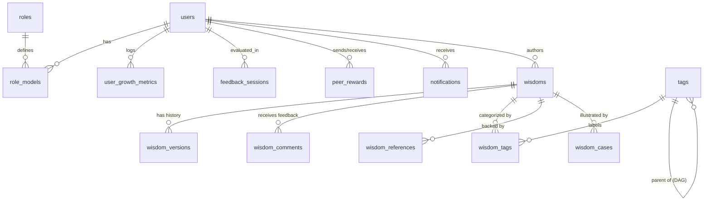

# 01_DATABASE_SCHEMA.md

## 1. エグゼクティブサマリー

OWLightは企業・自治体向けの次世代ナレッジマネジメントシステムであり、**PostgreSQL + Supabase + LLM支援**による「生きた知識基盤」を実現します。

本設計は、以下の原則に基づいています：

- **シンプルさと拡張性の両立**：PostgreSQL一択で高価なグラフDBを回避しつつ、GraphRAG的な関係探索を実現
- **AI支援と人間判断の融合**：LLMによる自動化とユーザー承認による品質担保
- **説明責任とトレーサビリティ**：全変更履歴を保持し、監査証跡を確保
- **フィードバック駆動の進化**：コメント・評価を通じて知恵が継続的に改善される仕組み

## 2. コアアーキテクチャの選定理由

### 2.1 Supabase + RPC（WITH RECURSIVE）の採用

PostgreSQLの`WITH RECURSIVE` CTEにより、知恵の派生関係（最大5段階程度）を効率的に探索可能です。Supabase RPCで複雑なロジックをDB側に集約し、フロントエンドのVibe Coding（AIとの高速実装）に最適化します。

---

## 3. データベース設計概要

OWLightのデータベースは **PostgreSQL (Supabase)** 上に構築されます。ユーザー情報、ロールモデル、成長ログ、そして「知恵（Wisdom）」の実体データなどのリレーショナルデータを管理します。

**重要なアーキテクチャ方針:**

- **ベクトルデータ/検索インデックス**: Supabase (PostgreSQL) では管理しません。**Google Cloud Vertex AI Agent Builder (Vertex AI Search)** 側で管理されます。
- **データ同期**: `wisdoms` テーブルの更新時に、API経由でリアルタイムに Vertex AI へデータをプッシュします (`indexDocument`)。
- **グラフ探索**: `WITH RECURSIVE` を用いたRPC関数により、知恵の関連性を高速に取得します。

## 4. ER図 (Entity Relationship Diagram)

## 5. テーブル定義詳細

### 5.1 Wisdom & Core (知恵・フィードバック基盤)

#### `public.wisdoms`

知恵の実体データ。**最新版のみを保持し、Vertex AI に同期されます。**

| Column | Type | Constraints | Description |
| --- | --- | --- | --- |
| `id` | SERIAL | PK | ID |
| `title` | TEXT | NOT NULL | タイトル |
| `content` | TEXT | NOT NULL | 本文 (Markdown) |
| `summary` | TEXT |  | 要約 (LLM生成) |
| `version` | INT | DEFAULT 1 | 最新バージョン番号 |
| `like_count` | INT | DEFAULT 0 | いいね数 (キャッシュ) |
| `view_count` | INT | DEFAULT 0 | 閲覧数 (キャッシュ) |
| `helpful_count` | INT | DEFAULT 0 | 役立ち度数 (キャッシュ) |
| `quality_score` | DECIMAL(5,2)| DEFAULT 0 | 総合スコア (0-100) |
| `created_by` | UUID | FK(users) | 作成者ID |
| `updated_by` | UUID | FK(users) | 最終更新者ID |
| `created_at` | TIMESTAMPTZ | DEFAULT NOW() | 作成日時 |
| `updated_at` | TIMESTAMPTZ | DEFAULT NOW() | 更新日時 |
| `search_vector` | TSVECTOR |  | 全文検索用インデックス |

#### `public.wisdom_versions`

知恵の変更履歴。監査証跡と復元のためにスナップショットを保持します。

| Column | Type | Constraints | Description |
| --- | --- | --- | --- |
| `id` | SERIAL | PK | ID |
| `wisdom_id` | INT | FK(wisdoms) | 対象の知恵 |
| `version` | INT | NOT NULL | バージョン番号 |
| `title` | TEXT |  | スナップショット：タイトル |
| `content` | TEXT |  | スナップショット：本文 |
| `summary` | TEXT |  | スナップショット：要約 |
| `changed_by` | UUID | FK(users) | 変更者ID |
| `change_reason` | TEXT |  | 変更理由 |
| `change_summary` | TEXT |  | 変更内容のサマリー |
| `reflected_comment_ids`| INT[] | DEFAULT '{}' | 反映されたコメントID群 |
| `created_at` | TIMESTAMPTZ | DEFAULT NOW() | 記録日時 |

#### `public.tags`

階層的タグシステム。多重親（DAG）をサポートします。

| Column | Type | Constraints | Description |
| --- | --- | --- | --- |
| `id` | SERIAL | PK | ID |
| `name` | TEXT | UNIQUE, NOT NULL | タグ名 |
| `parent_tag_ids` | INT[] | DEFAULT '{}' | 親タグIDの配列 (DAG構造) |
| `level` | INT | DEFAULT 0 | 階層レベル |
| `tag_source` | TEXT |  | 'manual', 'llm_auto', 'llm_approved' |
| `confidence_score`| DECIMAL(3,2) |  | LLM提案時の信頼度 |
| `usage_count` | INT | DEFAULT 0 | 使用頻度 |
| `description` | TEXT |  | 説明 |
| `created_at` | TIMESTAMPTZ | DEFAULT NOW() | 生成日時 |

#### `public.wisdom_tags`

知恵とタグの関連付け。

| Column | Type | Constraints | Description |
| --- | --- | --- | --- |
| `wisdom_id` | INT | FK(wisdoms) | 対象の知恵 |
| `tag_id` | INT | FK(tags) | 適用するタグ |
| `confidence_score`| DECIMAL(3,2) | DEFAULT 1.0 | 信頼度スコア |
| `is_approved` | BOOLEAN | DEFAULT FALSE | ユーザー承認フラグ |
| `suggested_by` | TEXT |  | 'llm', 'manual' |

#### `public.wisdom_comments`

知恵に対するフィードバック（コメント）。

| Column | Type | Constraints | Description |
| --- | --- | --- | --- |
| `id` | SERIAL | PK | ID |
| `wisdom_id` | INT | FK(wisdoms) | 対象の知恵 |
| `user_id` | UUID | FK(users) | ユーザーID |
| `comment_text` | TEXT | NOT NULL | コメント本文 |
| `comment_type` | TEXT |  | 'correction', 'addition', 'question'等 |
| `is_reflected` | BOOLEAN | DEFAULT FALSE | 知恵本体への反映済みフラグ |
| `reflected_at` | TIMESTAMPTZ |  | 反映日時 |
| `reflected_in_version`| INT |  | 反映されたバージョン番号 |
| `helpful_count` | INT | DEFAULT 0 | 役立ち度 |
| `created_at` | TIMESTAMPTZ | DEFAULT NOW() | 投稿日時 |

#### `public.wisdom_references`

知恵の信頼性を担保する根拠・出典管理。

| Column | Type | Constraints | Description |
| --- | --- | --- | --- |
| `id` | SERIAL | PK | ID |
| `wisdom_id` | INT | FK(wisdoms) | 対象の知恵 |
| `reference_type` | TEXT |  | 'law', 'regulation', 'guideline'等 |
| `title` | TEXT | NOT NULL | 出典タイトル |
| `description` | TEXT |  | 詳細 |
| `url` | TEXT |  | 外部URL |
| `citation` | TEXT |  | 引用箇所 (例: 第3条) |
| `is_primary` | BOOLEAN | DEFAULT FALSE | 主な根拠フラグ |
| `confidence_score`| DECIMAL(3,2) | DEFAULT 1.0 | 信頼度スコア |

#### `public.wisdom_cases`

具体的な事例や失敗談。暗黙知を構造化して保持します。

| Column | Type | Constraints | Description |
| --- | --- | --- | --- |
| `id` | SERIAL | PK | ID |
| `wisdom_id` | INT | FK(wisdoms) | 対象の知恵 |
| `case_type` | TEXT |  | 'success', 'failure', 'common' |
| `title` | TEXT | NOT NULL | 事例タイトル |
| `situation` | TEXT |  | 状況 |
| `action` | TEXT |  | 対応 |
| `result` | TEXT |  | 結果 |
| `lesson` | TEXT |  | 教訓 |
| `organization_type`| TEXT |  | 組織種別 |
| `year` | INT |  | 実施年 |
| `is_anonymous` | BOOLEAN | DEFAULT TRUE | 匿名フラグ |
| `helpful_count` | INT | DEFAULT 0| 役立ち度 |

### 2. Users & Roles (ユーザー・役割)

#### `public.users`

ユーザーの基本プロフィール。Supabase Authと連動。

| Column | Type | Constraints | Description |
| --- | --- | --- | --- |
| `id` | UUID | PK, FK(auth.users) | ユーザーID |
| `email` | TEXT | UNIQUE, NOT NULL | メールアドレス |
| `display_name` | TEXT | NOT NULL | 表示名 |
| `avatar_url` | TEXT |  | アバター画像URL |
| `bio` | TEXT |  | 自己紹介 |
| `role` | TEXT | DEFAULT 'general' | 'admin', 'manager', 'general' |
| `created_at` | TIMESTAMPTZ | DEFAULT NOW() | 登録日時 |

#### `public.roles`

フクロウのタイプ（役割）定義マスタ。

| Column | Type | Constraints | Description |
| --- | --- | --- | --- |
| `id` | SERIAL | PK | ロールID |
| `key` | TEXT | UNIQUE, NOT NULL | 'innovator' 等の参照キー |
| `name` | TEXT | NOT NULL | ロール名 |
| `description` | TEXT | NOT NULL | 説明文 |

#### `public.role_models`

ユーザーごとの役割診断結果。

| Column | Type | Constraints | Description |
| --- | --- | --- | --- |
| `id` | SERIAL | PK | ID |
| `user_id` | UUID | FK(users) | ユーザーID |
| `role_id` | INT | FK(roles) | ロールID |
| `match_score` | INTEGER | DEFAULT 0 | 診断適合度 |

### 3. Growth & Evaluation (成長・評価)

#### `public.user_growth_metrics`

成長指標の時系列ログ。

| Column | Type | Constraints | Description |
| --- | --- | --- | --- |
| `id` | SERIAL | PK | ID |
| `user_id` | UUID | FK(users) | ユーザーID |
| `recorded_at` | DATE | NOT NULL | 記録日 |
| `total_wisdom_points` | INTEGER | DEFAULT 0 | 累積ポイント |
| `skill_dimensions` | JSONB |  | レーダーチャート用データ |

#### `public.peer_rewards`

ピアボーナス（称賛）の履歴。

| Column | Type | Constraints | Description |
| --- | --- | --- | --- |
| `id` | SERIAL | PK | ID |
| `sender_id` | UUID | FK(users) | 送信者 |
| `receiver_id` | UUID | FK(users) | 受信者 |
| `points` | INTEGER | CHECK (>0) | 付与ポイント |
| `message` | TEXT | NOT NULL | メッセージ |

#### `public.feedback_sessions`

1on1評価面談の記録。

| Column | Type | Constraints | Description |
| --- | --- | --- | --- |
| `id` | SERIAL | PK | ID |
| `user_id` | UUID | FK(users) | 被評価者 |
| `reviewer_id` | UUID | FK(users) | 評価者 |
| `status` | TEXT |  | 'draft', 'completed' |
| `content` | JSONB |  | 面談ログ詳細 |

### 4. System & Notifications

#### `public.system_prompts`

Vertex AI (Gemini) に渡すシステムプロンプト管理。

| Column | Type | Constraints | Description |
| --- | --- | --- | --- |
| `id` | SERIAL | PK | ID |
| `key` | TEXT | UNIQUE | プロンプトキー |
| `content` | TEXT | NOT NULL | プロンプト本文 |
| `model_config` | JSONB |  | Vertex AI パラメータ設定 |

#### `public.notifications`

各種通知データ。

| Column | Type | Constraints | Description |
| --- | --- | --- | --- |
| `id` | SERIAL | PK | ID |
| `user_id` | UUID | FK(users) | 受信者 |
| `type` | TEXT |  | 'sos', 'thanks', 'system' |
| `content` | JSONB |  | 通知ペイロード |
| `is_read` | BOOLEAN | DEFAULT FALSE | 既読ステータス |

#### `public.health_check`

インフラの疎通確認用の軽量テーブル。

| Column | Type | Constraints | Description |
| --- | --- | --- | --- |
| `id` | SERIAL | PK | ID |
| `created_at` | TIMESTAMPTZ | DEFAULT NOW() | 作成日時 |

## 6. セキュリティポリシー (RLS)

1. **参照権限**:
   - `users`, `roles`, `wisdoms`, `tags` は全認証ユーザーが参照可能。
   - `peer_rewards` は組織の透明性のため全ユーザー参照可能。
2. **非公開データ**:
   - `notifications`, `feedback_sessions` は本人またはマネージャーのみ参照可能。
3. **管理者権限**:
   - `system_prompts` の編集は管理者のみ許可。

## 7. 主要RPC関数リファレンス

- `get_wisdom_full_context(p_wisdom_id INT)`
  知恵、タグ、参照文献、事例、コメントを一括取得します。
- `calculate_wisdom_quality_score(p_wisdom_id INT)`
  いいね数、役立ち度、品質などを元に `quality_score` を算出・更新します。
- `get_tag_hierarchy(p_tag_id INT)`
  指定タグから親方向へ階層を遡ります。

## 8. Vertex AI 連携に関する補足

- **Embedding**: ベクトルデータの保存は **Vertex AI Search** 側で行います。
- **Sync Logic**: `wisdoms` テーブルの更新をトリガーに、タイトルと本文を Vertex AI へ送信します。
- **Priority**: `quality_score` を検索時のブーストメタデータとして使用可能です。
