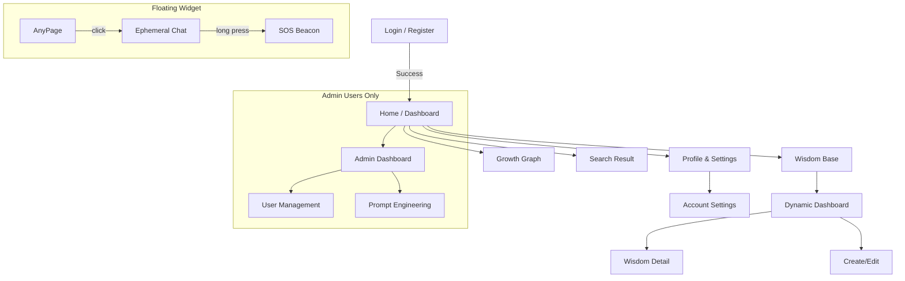

# 03_SCREEN_DESIGN.md

## 概要

OWLightの画面遷移と主要画面のレイアウト定義です。
**Teal (#218F8D)** をプライマリーカラーとし、**「Gentle Professionalism（知的で優しい）」** デザイン原則に基づいたUIを構築します。
特に検索結果画面は、**Vertex AI (ランキング)** と **Supabase (表示データ)** の役割分担を明確に反映した設計とします。

## 画面遷移図 (Site Map)

## 主要画面ワイヤーフレーム & レイアウト

### 1. グローバルレイアウト (Common Layout)

全画面共通の枠組み。

* **Header (Sticky Top)**
* **Left**: ロゴ (OWLight)
* **Center**: `GlobalSearchBar`
* **Data Source**: Vertex AI Search Autocomplete (入力候補)。
* **UI**: プレースホルダー "何でも聞いてください..."、フォーカス時にドロップダウン展開。

* **Right**: 通知ベル、ユーザーアバター (Dropdown Menu)

* **Sidebar (Collapsible Left)**
    *   **Toggle**: ハンバーガーアイコン（≡）で Gemini 風の伸縮が可能。
    *   **Expanded (Default)**: アイコン + メニューテキストを表示 (256px)。
    *   **Collapsed**: アイコンのみ表示 (80px)。
    *   **Active State**: 背景色 Teal (Opacity 10%) + Teal Text + 左端ボーダー。

### 2. ホーム / ダッシュボード (`/home`)

ログイン直後のランディングページ。情報の密度と視認性のバランスを重視。

| エリア | コンポーネント | 内容・データソース |
| --- | --- | --- |
| **Main (Left 2/3)** | **Welcome Header** | "こんにちは、{User}さん"。現在のロールバッジ表示。 |
|  | **GrowthTimeline** | `growth-viz-ui-timeline`。過去6ヶ月の成長推移グラフ (Supabase: `user_growth_metrics`)。 |
|  | **Quick Actions** | [知恵を書く] [成長記録を見る] [プロフィール更新] |
| **Sub (Right 1/3)** | **Recent Activity** | フォロー中のユーザーの更新、受け取った称賛 (Supabase)。 |
|  | **Recommended** | **Ranking**: Vertex AI (Recommend API) がIDを提供。 

 **Display**: Supabase から取得したタイトル・著者情報を表示。 |

### 3. 統合検索結果画面 (`/search`)

ハイブリッド検索アーキテクチャを反映したUI。

| エリア | コンポーネント | 内容・データソース |
| --- | --- | --- |
| **Left Sidebar** | **SearchFilters** | **Tag Cloud**: `Supabase` から取得した人気タグ一覧。 

 **Date Range**: 期間指定フィルタ。 |
| **Center Main** | **AI Answer Box** | **Vertex AI (Gemini)** 生成の要約回答（Grounding）。 

 検索上位の記事内容を要約して表示。 |
|  | **Result List** | **Data Source**: タイトル、本文スニペット、著者、タグ、バッジは全て **Supabase** から取得。 

 **Order**: Vertex AI が返却した IDリスト順にソートして表示。 

 **Trust Tier**: Supabase の `quality_score` に基づき「Gold/Silver」バッジを表示。 |

### 3.5. 知恵ダッシュボード (`/wisdom`)
検索の初期画面であり、動的な発見を促すダッシュボード。

* **Dynamic Carousel (7-Axis)**:
  7秒おきに自動でスライドし、以下の7つの軸でナレッジを提示する。
  1.  **🚀 New Arrivals (新着)**: 最新の知恵
  2.  **⭐ Highly Rated (高評価)**: 評価スコアが高い順
  3.  **🔥 Hot Topics (話題)**: コメント・閲覧等のエンゲージメントが高い順
  4.  **🌱 Needs Contribution (求む！知見)**: 非Gold または 更新が古い知恵
  5.  **🔄 Freshly Polished (更新)**: 最近更新された知恵
  6.  **🎯 Recommended (おすすめ)**: パーソナライズ（Mock）
  7.  **📅 Seasonal Topics (季節)**: 季節性タグに基づく知恵
  * **Visuals**: 進捗バー（プログレスバー）でスライドのタイミングを表示。バッジは 🥇Gold / 🥈Silver / 🥉Bronze のアイコン付き。

* **Search Bar**:
  ページ中央に配置。ダッシュボードの下でいつでも検索可能。

### 4. 知恵詳細 (`/wisdom/:id`)

記事閲覧だけでなく、コラボレーションの中心となるハブ画面（V2 Design）。

* **Action Bar (Top/Sticky)**:
    * **Edit** (Author only): 編集画面へ遷移。
    * **Copy Link**: 共有用URLをコピー。
    * **Share**: 外部ツールへの共有メニュー。

* **Header Area**:
    * **Title**: 大きく明瞭に表示。
    * **Metadata**: 作成日、タグ、著者情報（アバター＋名前）。
    * **Trust Tier**: 評価スコアに基づく Gold/Silver/Bronze バッジ。
    * **Incentive Banner**: Gold未満の場合、「加筆してポイント獲得」を促すバナーを表示（Gamification）。

* **Main Content (Card Layout)**:
    * **Summary**: 「概要」カード。
    * **Body**: 見出し付きの「内容」セクション。
    * **Structured Cards**: 「背景・コンテキスト」「根拠法令」「具体例」を独立したカードで視覚的に整理。

* **Engagement Footer**:
    * **Thanks Button**: フクロウモチーフの「感謝」ボタン（いいね）。アニメーション付き。

* **Collaboration Section**:
    * **Comments List**: スレッド形式のディスカッション。
    * **Best Answer**: 有用な補足情報に対するハイライト機能。
    * **Comment Form**: Markdownサポートの入力エリア。

### 5. 知恵エディタ (`/wisdom/create`, `/wisdom/edit`)

ウィザード形式とAIアシスタントを統合した高度な編集環境。

*   **Header**:
    *   ページタイトル（例：「新しい知恵を作成」）
    *   **Wizard Navigation**: 「次へ」「戻る」のアクションを強調。最終ステップのみ「保存」を表示。
    *   **Breadcrumbs**: 現在のステップ（基本情報 > 背景 > 具体例）を視覚化。

*   **Layout (Side-by-Side)**:
    *   **Left (Main Editor)**: タブ切り替え式の入力フォーム。
        1. 基本情報
        2. 背景・根拠
        3. 具体例・注意点
    *   **Resizer**: 左右パネルの境界線をドラッグして幅を調整可能。
    *   **Right (AI Assistant)**: チャットインターフェース。
        *   **Modes**: 生成, 磨き上げ, 要約。
        *   **Collapsible**: `>>` で最小化（アイコンのみの帯を表示）、`<<` で再展開。
        *   **Interaction**: AI生成案を「エディタに反映」ボタンでメインフォームへ同期。

### 6. プロフィール設定 (`/settings/profile`)

自己表現の設定。

* **Avatar Section**: 現在の画像（円形）と「変更」ボタン。プレビュー機能付き。
* **Form**:
* Display Name (Input)
* Bio (Textarea) - 自己紹介。

* **Role Display**: 現在のロールタイプ（例: "Innovator"）と説明を表示（編集不可）。

### 7. サンクチュアリ (Floating Widget)

画面右下に常駐する心理的安全性機能。

* **Closed State**: フクロウアイコン babys (Floating Action Button)。
* **Open State (Chat)**:
* **Header**: "ここでの会話は保存されません" (Warning text)。
* **Body**: チャットログ（ローカルステートのみ。BackendもMemory only）。
* **Input**: メッセージ入力。

* **SOS Button**:
* チャットヘッダー内または独立して配置。
* **Interaction**: 3秒長押しで円形プログレスが進行 → 送信完了。

### 8. 管理画面 (`/admin`)

機能性を重視したDense（高密度）なレイアウト。

* **User List**: データテーブル。検索、フィルタ、ロール変更ドロップダウン。
* **Prompt Editor**:
* 左ペイン: プロンプト一覧 (List)。
* 右ペイン: 選択したプロンプトのエディタ (Monospace Textarea)。Vertex AI に送る設定値を調整。
