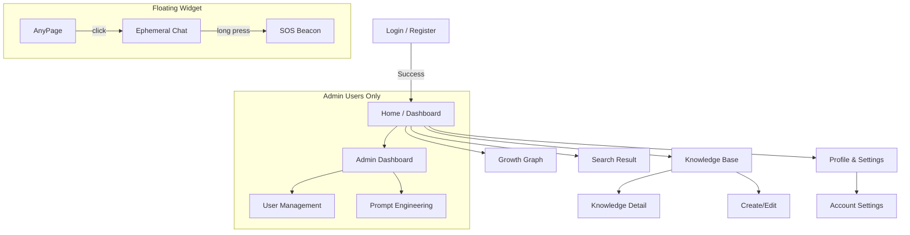

# 03_SCREEN_DESIGN.md

## 概要

OWLightの画面遷移と主要画面のレイアウト定義です。
**Teal (#218F8D)** をプライマリーカラーとし、**「Gentle Professionalism（知的で優しい）」** デザイン原則に基づいたUIを構築します。
特に検索結果画面は、**Vertex AI (ランキング)** と **Supabase (表示データ)** の役割分担を明確に反映した設計とします。

## 画面遷移図 (Site Map)

## 主要画面ワイヤーフレーム & レイアウト

### 1. グローバルレイアウト (Common Layout)

全画面共通の枠組み。

* **Header (Sticky Top)**
* **Left**: ロゴ (OWLight)
* **Center**: `GlobalSearchBar`
* **Data Source**: Vertex AI Search Autocomplete (入力候補)。
* **UI**: プレースホルダー "何でも聞いてください..."、フォーカス時にドロップダウン展開。

* **Right**: 通知ベル、ユーザーアバター (Dropdown Menu)

* **Sidebar (Fixed Left / Mobile Drawer)**
* **Menu**: Home, Knowledge, Directory, Growth, Settings, (Admin)
* **Active State**: 背景色 Teal (Opacity 10%) + Teal Text + 左端ボーダー

### 2. ホーム / ダッシュボード (`/home`)

ログイン直後のランディングページ。情報の密度と視認性のバランスを重視。

| エリア | コンポーネント | 内容・データソース |
| --- | --- | --- |
| **Main (Left 2/3)** | **Welcome Header** | "こんにちは、{User}さん"。現在のロールバッジ表示。 |
|  | **GrowthTimeline** | `growth-viz-ui-timeline`。過去6ヶ月の成長推移グラフ (Supabase: `user_growth_metrics`)。 |
|  | **Quick Actions** | [ナレッジを書く] [成長記録を見る] [プロフィール更新] |
| **Sub (Right 1/3)** | **Recent Activity** | フォロー中のユーザーの更新、受け取った称賛 (Supabase)。 |
|  | **Recommended** | **Ranking**: Vertex AI (Recommend API) がIDを提供。 

 **Display**: Supabase から取得したタイトル・著者情報を表示。 |

### 3. 統合検索結果画面 (`/search`)

ハイブリッド検索アーキテクチャを反映したUI。

| エリア | コンポーネント | 内容・データソース |
| --- | --- | --- |
| **Left Sidebar** | **SearchFilters** | **Tag Cloud**: `Supabase` から取得した人気タグ一覧。 

 **Date Range**: 期間指定フィルタ。 |
| **Center Main** | **AI Answer Box** | **Vertex AI (Gemini)** 生成の要約回答（Grounding）。 

 検索上位の記事内容を要約して表示。 |
|  | **Result List** | **Data Source**: タイトル、本文スニペット、著者、タグ、バッジは全て **Supabase** から取得。 

 **Order**: Vertex AI が返却した IDリスト順にソートして表示。 

 **Trust Tier**: Supabase の `evaluation_score` に基づき「Gold/Silver」バッジを表示。 |

### 4. ナレッジ詳細 (`/knowledge/:id`)

記事の閲覧とインタラクション。

* **Header**:
* タイトル、作成日、タグ（Supabase）。
* **Author Info**: アバター、名前、ロールバッジ。
* **Trust Tier**: 評価スコア (`evaluation_score`) に基づく信頼性バッジ。

* **Body**: Markdownレンダリングされた本文。
* **Footer**:
* **Praise Button**: 称賛を送るアクション（→ `evaluation_score` 更新）。
* **Comments**: コメントスレッド。

* **Floating**: 編集ボタン（作成者のみ）。

### 5. プロフィール設定 (`/settings/profile`)

自己表現の設定。

* **Avatar Section**: 現在の画像（円形）と「変更」ボタン。プレビュー機能付き。
* **Form**:
* Display Name (Input)
* Bio (Textarea) - 自己紹介。

* **Role Display**: 現在のロールタイプ（例: "Innovator"）と説明を表示（編集不可）。

### 6. サンクチュアリ (Floating Widget)

画面右下に常駐する心理的安全性機能。

* **Closed State**: フクロウアイコンのFAB (Floating Action Button)。
* **Open State (Chat)**:
* **Header**: "ここでの会話は保存されません" (Warning text)。
* **Body**: チャットログ（ローカルステートのみ。BackendもMemory only）。
* **Input**: メッセージ入力。

* **SOS Button**:
* チャットヘッダー内または独立して配置。
* **Interaction**: 3秒長押しで円形プログレスが進行 → 送信完了。

### 7. 管理画面 (`/admin`)

機能性を重視したDense（高密度）なレイアウト。

* **User List**: データテーブル。検索、フィルタ、ロール変更ドロップダウン。
* **Prompt Editor**:
* 左ペイン: プロンプト一覧 (List)。
* 右ペイン: 選択したプロンプトのエディタ (Monospace Textarea)。Vertex AI に送る設定値を調整。
